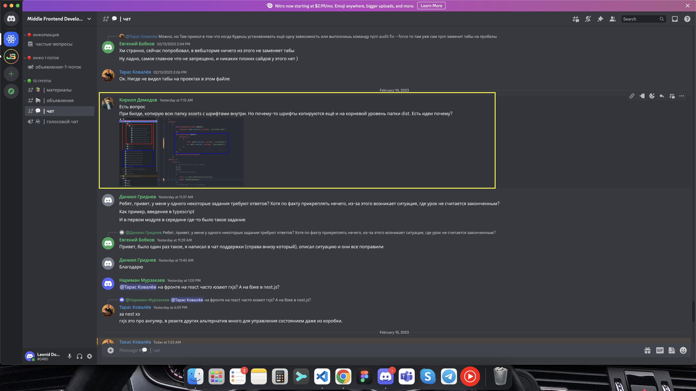

# Questions

- why does CopyWebpackPlugin runs only on 'npm run build' (not 'npm run start'), is it ok?
- how to make font files be located in the /assets/fonts/ folder, on build they are generated right in /dist/ folder



## Create folders:

```
project/
  dist/
  public/
  index.html
  src/
  index.css
  index.js
```

## Init

npm init

## Webpack

npm i webpack webpack-cli --save-dev

## webpack.config.js

entry

```js
entry: './index.js',
```

output

```js
output: {
  filename: '[name].[contenthash].bundle.js',
  path: path.resolve(__dirname, 'dist'),
  clean: true,
},
```

## HtmlWebpackPlugin

npm install --save-dev html-webpack-plugin

- minify html
- include scripts in html

```js
plugins: [
  // ...
  new HtmlWebpackPlugin({
    template: path.resolve(__dirname, `${dirPublic}/index.html`),
  }),
];
```

## CopyWebpackPlugin

npm install copy-webpack-plugin --save-dev

- copy static files to the bundle (ex. favicon)

```js
plugins: [
  //...
  new CopyPlugin({
    patterns: [
      {
        from: path.resolve(__dirname, `${dirPublic}/favicon/`),
        to: path.resolve(__dirname, `${dirDist}/favicon/`),
      },
    ],
  }),
];
```

## css

npm install css-loader style-loader --save-dev

- style-loader
- css-loader

### to use css in external file: MiniCssExtractPlugin

npm install --save-dev mini-css-extract-plugin

```js
plugins: [
    // ...
    new MiniCssExtractPlugin()
  ],
  module: {
    rules: [
      {
        test: /\.css$/i,
        use: [MiniCssExtractPlugin.loader, "css-loader"],
      },
    ],
  }
```

## fonts

```js
module: {
  rules: [
    // ...
    {
      test: /\.(woff|woff2|eot|ttf|otf)$/i,
      type: 'asset/resource',
    },
  ],
}
```

## scss

npm install sass-loader sass webpack --save-dev

```js
module: {
  rules: [
    // ...
    {
      test: /\.s[ac]ss$/i,
      use: [MiniCssExtractPlugin.loader, "css-loader", "sass-loader"],
    },
  ],
}
```

## minifying css, js

css : CssMinimizerPlugin
npm install css-minimizer-webpack-plugin --save-dev

```js
optimization: {
  minimizer: [
    new CssMinimizerPlugin(),
  ],
},
```

js : TerserPlugin
npm install terser-webpack-plugin --save-dev

```js
optimization: {
  minimizer: [
    new CssMinimizerPlugin(),
    new TerserPlugin()
  ],
},
```

## modes

webpack-merge : merge configs

### dev

```js
const { merge } = require('webpack-merge');
const commonConfig = require('./webpack.config.common.js');

module.exports = merge(commonConfig, {
  mode: 'development',
  devtool: 'inline-source-map',
});
```

### prod

```js
const { merge } = require('webpack-merge');
const commonConfig = require('./webpack.config.common.js');
const CssMinimizerPlugin = require('css-minimizer-webpack-plugin');
const TerserPlugin = require('terser-webpack-plugin');

module.exports = merge(commonConfig, {
  mode: 'production',
  devtool: 'source-map',
  optimization: {
    minimizer: [new CssMinimizerPlugin(), new TerserPlugin()],
  },
});
```

## Local server

webpack-dev-server
npm install --save-dev webpack webpack-dev-server

dev config

```js
devServer: {
  port: 3000,
  hot: true,
  open: true,
}
```

## ESLint

npm install eslint eslint-webpack-plugin --save-dev

```js
const ESLintPlugin = require('eslint-webpack-plugin');

module.exports = merge(commonConfig, {
  // ...
  plugins: [new ESLintPlugin()],
});
```

## App

- HTML
- SCSS

### JS

- using bubbling & capturing concept, capture click on each item
- get data for each item using dataset

- change bg image

- get parent list, loop through the list, remove active className for items who's dataset doesn't correspond with activeItem dataset
- toggle className for activeItem

- pause all of the audios
- if activeItem contains activeClassName, play audio

- handle volume input onChange

## Time

### Estimate:

8 hours is quite enough

### "Mistakes":

- spent quite a lot of time trying to implement own React.js,
- spent a lot of time on ESLint config

# Questions

- why does CopyWebpackPlugin runs only on 'npm run build' (not 'npm run start'), is it ok?
- how to make font files be located in the /assets/fonts/ folder, on build they are generated right in /dist/ folder
